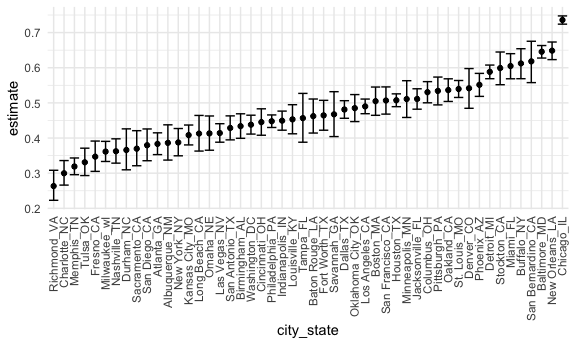
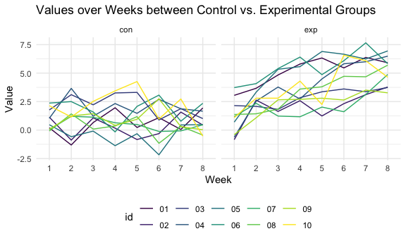
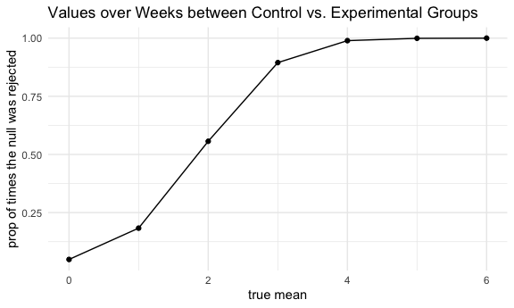
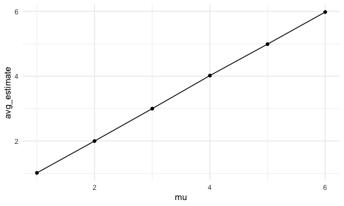
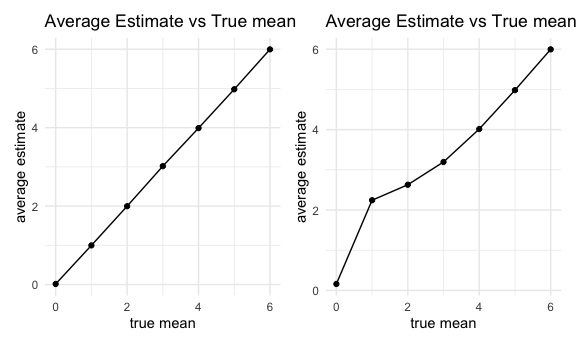

Homework 5
================
Tianheng Hu

## Problem 1

Read in the data.

``` r
homicide_df = 
  read_csv("./data/homicide-data.csv") %>% 
  mutate(
    city_state = str_c(city, state, sep = "_"),
    resolved = case_when(
      disposition == "Closed without arrest" ~ "unsolved",
      disposition == "Open/No arrest"        ~ "unsolved",
      disposition == "Closed by arrest"      ~ "solved",
    )
  ) %>% 
  select(city_state, resolved) %>% 
  filter(city_state != "Tulsa_AL")
```

    ## Parsed with column specification:
    ## cols(
    ##   uid = col_character(),
    ##   reported_date = col_double(),
    ##   victim_last = col_character(),
    ##   victim_first = col_character(),
    ##   victim_race = col_character(),
    ##   victim_age = col_character(),
    ##   victim_sex = col_character(),
    ##   city = col_character(),
    ##   state = col_character(),
    ##   lat = col_double(),
    ##   lon = col_double(),
    ##   disposition = col_character()
    ## )

Let’s look at this a bit

``` r
aggregate_df = 
  homicide_df %>% 
  group_by(city_state) %>% 
  summarize(
    hom_total = n(),
    hom_unsolved = sum(resolved == "unsolved")
  )
```

    ## `summarise()` ungrouping output (override with `.groups` argument)

Can I do a prop test for a single city?

``` r
prop.test(
  aggregate_df %>% filter(city_state == "Baltimore_MD") %>% pull(hom_unsolved), 
  aggregate_df %>% filter(city_state == "Baltimore_MD") %>% pull(hom_total)) %>% 
  broom::tidy()
```

    ## # A tibble: 1 x 8
    ##   estimate statistic  p.value parameter conf.low conf.high method    alternative
    ##      <dbl>     <dbl>    <dbl>     <int>    <dbl>     <dbl> <chr>     <chr>      
    ## 1    0.646      239. 6.46e-54         1    0.628     0.663 1-sample… two.sided

Try to iterate

``` r
results_df = 
  aggregate_df %>% 
  mutate(
    prop_tests = map2(.x = hom_unsolved, .y = hom_total, ~prop.test(x = .x, n = .y)),
    tidy_tests = map(.x = prop_tests, ~broom::tidy(.x))
  ) %>% 
  select(-prop_tests) %>% 
  unnest(tidy_tests) %>% 
  select(city_state, estimate, conf.low, conf.high)
```

Create a plot that shows the estimates and CIs for each city

``` r
results_df %>% 
  mutate(city_state = fct_reorder(city_state, estimate)) %>% 
  ggplot(aes(x = city_state, y = estimate)) +
  geom_point() + 
  geom_errorbar(aes(ymin = conf.low, ymax = conf.high)) + 
  theme(axis.text.x = element_text(angle = 90, vjust = 0.5, hjust = 1))
```



## Problem 2

This is a longitudinal study that included a control arm and an
experimental arm. Data for each participant is included in a separate
file, and file names include the subject ID and arm.

First, we import datasets

``` r
path_df = 
  tibble(
    path = list.files("lda_data"),
  ) %>% 
  mutate(
    data = map(.x = path, ~read_csv(str_c("lda_data/", .x)))) %>% 
  unnest()
```

    ## Parsed with column specification:
    ## cols(
    ##   week_1 = col_double(),
    ##   week_2 = col_double(),
    ##   week_3 = col_double(),
    ##   week_4 = col_double(),
    ##   week_5 = col_double(),
    ##   week_6 = col_double(),
    ##   week_7 = col_double(),
    ##   week_8 = col_double()
    ## )
    ## Parsed with column specification:
    ## cols(
    ##   week_1 = col_double(),
    ##   week_2 = col_double(),
    ##   week_3 = col_double(),
    ##   week_4 = col_double(),
    ##   week_5 = col_double(),
    ##   week_6 = col_double(),
    ##   week_7 = col_double(),
    ##   week_8 = col_double()
    ## )
    ## Parsed with column specification:
    ## cols(
    ##   week_1 = col_double(),
    ##   week_2 = col_double(),
    ##   week_3 = col_double(),
    ##   week_4 = col_double(),
    ##   week_5 = col_double(),
    ##   week_6 = col_double(),
    ##   week_7 = col_double(),
    ##   week_8 = col_double()
    ## )
    ## Parsed with column specification:
    ## cols(
    ##   week_1 = col_double(),
    ##   week_2 = col_double(),
    ##   week_3 = col_double(),
    ##   week_4 = col_double(),
    ##   week_5 = col_double(),
    ##   week_6 = col_double(),
    ##   week_7 = col_double(),
    ##   week_8 = col_double()
    ## )
    ## Parsed with column specification:
    ## cols(
    ##   week_1 = col_double(),
    ##   week_2 = col_double(),
    ##   week_3 = col_double(),
    ##   week_4 = col_double(),
    ##   week_5 = col_double(),
    ##   week_6 = col_double(),
    ##   week_7 = col_double(),
    ##   week_8 = col_double()
    ## )
    ## Parsed with column specification:
    ## cols(
    ##   week_1 = col_double(),
    ##   week_2 = col_double(),
    ##   week_3 = col_double(),
    ##   week_4 = col_double(),
    ##   week_5 = col_double(),
    ##   week_6 = col_double(),
    ##   week_7 = col_double(),
    ##   week_8 = col_double()
    ## )
    ## Parsed with column specification:
    ## cols(
    ##   week_1 = col_double(),
    ##   week_2 = col_double(),
    ##   week_3 = col_double(),
    ##   week_4 = col_double(),
    ##   week_5 = col_double(),
    ##   week_6 = col_double(),
    ##   week_7 = col_double(),
    ##   week_8 = col_double()
    ## )
    ## Parsed with column specification:
    ## cols(
    ##   week_1 = col_double(),
    ##   week_2 = col_double(),
    ##   week_3 = col_double(),
    ##   week_4 = col_double(),
    ##   week_5 = col_double(),
    ##   week_6 = col_double(),
    ##   week_7 = col_double(),
    ##   week_8 = col_double()
    ## )
    ## Parsed with column specification:
    ## cols(
    ##   week_1 = col_double(),
    ##   week_2 = col_double(),
    ##   week_3 = col_double(),
    ##   week_4 = col_double(),
    ##   week_5 = col_double(),
    ##   week_6 = col_double(),
    ##   week_7 = col_double(),
    ##   week_8 = col_double()
    ## )
    ## Parsed with column specification:
    ## cols(
    ##   week_1 = col_double(),
    ##   week_2 = col_double(),
    ##   week_3 = col_double(),
    ##   week_4 = col_double(),
    ##   week_5 = col_double(),
    ##   week_6 = col_double(),
    ##   week_7 = col_double(),
    ##   week_8 = col_double()
    ## )
    ## Parsed with column specification:
    ## cols(
    ##   week_1 = col_double(),
    ##   week_2 = col_double(),
    ##   week_3 = col_double(),
    ##   week_4 = col_double(),
    ##   week_5 = col_double(),
    ##   week_6 = col_double(),
    ##   week_7 = col_double(),
    ##   week_8 = col_double()
    ## )
    ## Parsed with column specification:
    ## cols(
    ##   week_1 = col_double(),
    ##   week_2 = col_double(),
    ##   week_3 = col_double(),
    ##   week_4 = col_double(),
    ##   week_5 = col_double(),
    ##   week_6 = col_double(),
    ##   week_7 = col_double(),
    ##   week_8 = col_double()
    ## )
    ## Parsed with column specification:
    ## cols(
    ##   week_1 = col_double(),
    ##   week_2 = col_double(),
    ##   week_3 = col_double(),
    ##   week_4 = col_double(),
    ##   week_5 = col_double(),
    ##   week_6 = col_double(),
    ##   week_7 = col_double(),
    ##   week_8 = col_double()
    ## )
    ## Parsed with column specification:
    ## cols(
    ##   week_1 = col_double(),
    ##   week_2 = col_double(),
    ##   week_3 = col_double(),
    ##   week_4 = col_double(),
    ##   week_5 = col_double(),
    ##   week_6 = col_double(),
    ##   week_7 = col_double(),
    ##   week_8 = col_double()
    ## )
    ## Parsed with column specification:
    ## cols(
    ##   week_1 = col_double(),
    ##   week_2 = col_double(),
    ##   week_3 = col_double(),
    ##   week_4 = col_double(),
    ##   week_5 = col_double(),
    ##   week_6 = col_double(),
    ##   week_7 = col_double(),
    ##   week_8 = col_double()
    ## )
    ## Parsed with column specification:
    ## cols(
    ##   week_1 = col_double(),
    ##   week_2 = col_double(),
    ##   week_3 = col_double(),
    ##   week_4 = col_double(),
    ##   week_5 = col_double(),
    ##   week_6 = col_double(),
    ##   week_7 = col_double(),
    ##   week_8 = col_double()
    ## )
    ## Parsed with column specification:
    ## cols(
    ##   week_1 = col_double(),
    ##   week_2 = col_double(),
    ##   week_3 = col_double(),
    ##   week_4 = col_double(),
    ##   week_5 = col_double(),
    ##   week_6 = col_double(),
    ##   week_7 = col_double(),
    ##   week_8 = col_double()
    ## )
    ## Parsed with column specification:
    ## cols(
    ##   week_1 = col_double(),
    ##   week_2 = col_double(),
    ##   week_3 = col_double(),
    ##   week_4 = col_double(),
    ##   week_5 = col_double(),
    ##   week_6 = col_double(),
    ##   week_7 = col_double(),
    ##   week_8 = col_double()
    ## )
    ## Parsed with column specification:
    ## cols(
    ##   week_1 = col_double(),
    ##   week_2 = col_double(),
    ##   week_3 = col_double(),
    ##   week_4 = col_double(),
    ##   week_5 = col_double(),
    ##   week_6 = col_double(),
    ##   week_7 = col_double(),
    ##   week_8 = col_double()
    ## )
    ## Parsed with column specification:
    ## cols(
    ##   week_1 = col_double(),
    ##   week_2 = col_double(),
    ##   week_3 = col_double(),
    ##   week_4 = col_double(),
    ##   week_5 = col_double(),
    ##   week_6 = col_double(),
    ##   week_7 = col_double(),
    ##   week_8 = col_double()
    ## )

    ## Warning: `cols` is now required when using unnest().
    ## Please use `cols = c(data)`

``` r
long_df = 
  path_df %>% 
  separate(col=path,into=c("arm","id"),sep="_") %>% 
  pivot_longer(
    week_1:week_8,
    names_to = "week",
    values_to = "value",
    names_prefix = "week_"
  ) %>% 
    mutate(
    id = gsub("\\.csv", "",id )
  )
long_df
```

    ## # A tibble: 160 x 4
    ##    arm   id    week  value
    ##    <chr> <chr> <chr> <dbl>
    ##  1 con   01    1      0.2 
    ##  2 con   01    2     -1.31
    ##  3 con   01    3      0.66
    ##  4 con   01    4      1.96
    ##  5 con   01    5      0.23
    ##  6 con   01    6      1.09
    ##  7 con   01    7      0.05
    ##  8 con   01    8      1.94
    ##  9 con   02    1      1.13
    ## 10 con   02    2     -0.88
    ## # … with 150 more rows

Make a spaghetti plot showing observations on each subject over time,
and comment on differences between groups.

``` r
long_df %>% 
  ggplot(aes(x = week, y = value, color = id, group = id)) +
  geom_line()+
  facet_grid(~arm) +
  labs(
    x = "Week",
    y = "Value",
    title = "Values over Weeks between Control vs. Experimental Groups"
  ) 
```



From the two plots, within experimental group the values have an
increasing trend and the values are constant in the control group. There
are more fluctuations in values over different weeks in control group
then experimental group.

# Problem 3

Conduct a simulation of t test for mean when population mean is 0.

``` r
set.seed(1234)
sim_ttest = function(mu) {
  
  sim_data = 
    tibble(
    x = rnorm(n = 30, mean = mu, sd = 5),
  ) 
  
  sim_data%>% 
    t.test(mu = 0, alternative = 'two.sided',conf.level = 0.95) %>%
    broom::tidy() %>% 
    select(estimate, p.value)
}


# generate results of 5000 datasets
sim_results =
  rerun(5000, sim_ttest(mu = 0)) %>% 
  bind_rows() 
```

Repeat the above for μ={1,2,3,4,5,6}.

``` r
sim_results_mu =
  tibble(
    mu = c(1,2,3,4,5,6)
  ) %>% 
  mutate(
    output_lists = map(.x = mu, ~ rerun(5000, sim_ttest(mu = .x))),
    estimate_df = map(output_lists, bind_rows)
  ) %>% 
  select(-output_lists) %>% 
  unnest(estimate_df) %>% 
  mutate(reject = ifelse(p.value<0.05, "reject","don't reject"))
```

Make a plot showing the proportion of times the null was rejected (the
power of the test) on the y axis and the true value of μ on the x axis.
Describe the association between effect size and power.

``` r
sim_results_mu %>% 
  group_by(mu) %>% 
  summarize(
    n=n(),
    prop = sum(reject == "reject")/n) %>% 
  ggplot(aes(x = mu, y = prop))+
    geom_point()+
    geom_line() +
  labs(
    x = "true mean",
    y = "prop of times the null was rejected",
    title = "Values over Weeks between Control vs. Experimental Groups"
  ) 
```

    ## `summarise()` ungrouping output (override with `.groups` argument)



From the plot, the effect size which is the different between true mean
and null increases, the proportion of times the null was rejected
increases. So effect size and power has a positive association.

Make a plot showing the average estimate of μ̂ on the y axis and the
true value of μ on the x axis.

``` r
sim_results_mu %>% 
  group_by(mu) %>% 
  summarise(avg_estimate = mean(estimate)) %>% 
  ggplot(aes(x = mu, y = avg_estimate))+
  geom_point()+
  geom_line() 
```

    ## `summarise()` ungrouping output (override with `.groups` argument)



Make a second plot (or overlay on the first) the average estimate of μ̂
only in samples for which the null was rejected on the y axis and the
true value of μ on the x axis.

``` r
sim_results_mu %>% 
  filter(reject == "reject") %>% 
  group_by(mu) %>% 
  summarise(avg_estimate = mean(estimate)) %>% 
  ggplot(aes(x = mu, y = avg_estimate))+
  geom_point()+
  geom_line()
```

    ## `summarise()` ungrouping output (override with `.groups` argument)



For all samples, the average estimate of mean is the same as the true
mean. However, for those which the null is rejected, the average
estimates of mean is a little higher than the true mean when the mu is
1,2 or 3. They become equal to true mean when mu is 4,5 and 6. The
reason behind this is that if the power is low the averge estimates will
be different from the true mean. This average estimates will approximate
the true mean if the power increases.
